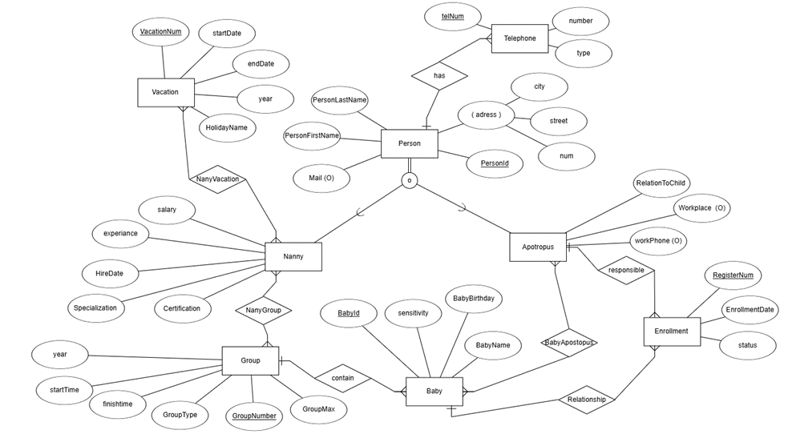
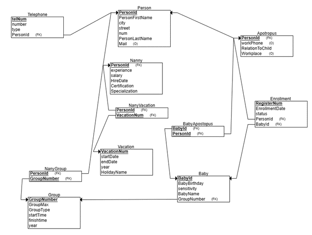

# Nursery School 

Sufiev Hadasa Hadar Example

## Table of Contents  
- [Phase 1: Design and Build the Database](#phase-1-design-and-build-the-database)  
  - [Introduction](#introduction)  
  - [ERD (Entity-Relationship Diagram)](#erd-entity-relationship-diagram)  
  - [DSD (Data Structure Diagram)](#dsd-data-structure-diagram)  
  - [SQL Scripts](#sql-scripts)  
  - [Data](#data)
  - [Backup](#backup)  
- [Phase 2: Integration](#phase-2-integration)  

## Phase 1: Design and Build the Database  

### Introduction

The **Nursery School Database** is designed to efficiently manage information related to children, parents, nannies, and nursery groups. This system ensures smooth organization and tracking of essential details such as group assignments, caregiver experience, child-parent relationships, and contact information.

#### Purpose of the Database
This database serves as a structured and reliable solution for nursery schools to:  
- **Organize groups** of children based on age, availability, and special needs.  
- **Manage caregiver assignments** by linking experienced nannies to specific groups.  
- **Maintain parent-child relationships**, ensuring smooth communication and accessibility.  
- **Store contact information**, including addresses, phone numbers, and emails.  
- **Track essential details** such as children's birthdates, allergies, and caregiver experience.  

#### Potential Use Cases
- **Nursery School Administrators** can use this database to efficiently allocate children to groups, assign caregivers, and store emergency contacts.  
- **Parents** can track their child's assigned group, caregiver details, and provide important information about allergies or special needs.  
- **Nannies** can view their assigned groups and the children under their care.  
- **Staff and Management** can use the system for record-keeping, scheduling, and communication.  

This structured database helps streamline nursery school operations, improving organization, safety, and communication among all parties involved.

###  ERD (Entity-Relationship Diagram)    
  

###  DSD (Data Structure Diagram)   
  

###  SQL Scripts  
Provide the following SQL scripts:  
- **Create Tables Script** - The SQL script for creating the database tables is available in the repository:  

📜 **[View `create_tables.sql`](Phase1/scripts/NurserySchoolCreateTable.sql)**  

- **Insert Data Script** - The SQL script for insert data to the database tables is available in the repository:  

📜 **[View `insert_tables.sql`](Phase1/scripts/NurserySchoolInserts.sql)**  
 
- **Drop Tables Script** - The SQL script for droping all tables is available in the repository:  

📜 **[View `drop_tables.sql`](Phase1/scripts/NurserySchoolDropTable.sql)**  

- **Select All Data Script**  - The SQL script for selectAll tables is available in the repository:  

📜 **[View `selectAll_tables.sql`](Phase1/scripts/NurserySchoolSelectAll.sql)**  
  
###  Data  
#### ** csv Data Files created by [mockaro](https://www.mockaroo.com/)** 
- - **person Data File** 
📜 **[View `personMock_data.csv`](Phase1/mockData/Person_MOCK_DATA.csv)**
- - **nanny Data File**
📜 **[View `personMock_data.csv`](Phase1/mockData/nannyMOCK_DATA.csv)**
- - **appotropus Data File**
📜 **[View `personMock_data.csv`](Phase1/mockData/appotropusMOCK_DATA.csv)**

- **Second Method**
- **Third Method**

### Backup 
-  The backup file is available in the repository:  

📜 **[View `backup`](Phase1/Backup/backup04032025)**  

## Phase 2: Integration 
